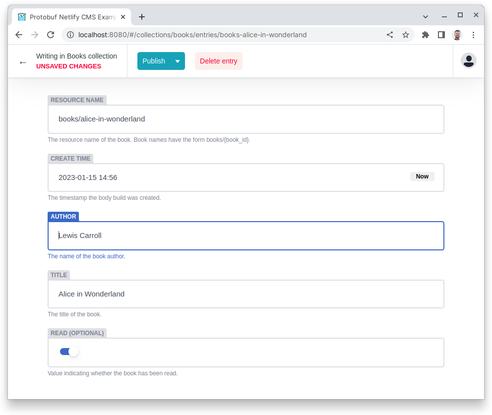

Protobuf Netlify CMS
====================

Manage protobuf resources using [Netlify CMS](https://www.netlifycms.org/).



How to
------

### Step 1: Define your protobuf resource(s)

```proto
// A book.
message Book {
  option (google.api.resource) = {
    type: "netlify-cms-example.einride.tech/Book",
    pattern: "books/{book}"
  };

  // The resource name of the book.
  // Book names have the form `books/{book_id}`.
  string name = 1;

  // The timestamp the body build was created.
  google.protobuf.Timestamp create_time = 2 [(google.api.field_behavior) = OUTPUT_ONLY];

  // The name of the book author.
  string author = 3 [(google.api.field_behavior) = REQUIRED];

  // The title of the book.
  string title = 4 [(google.api.field_behavior) = REQUIRED];

  // Value indicating whether the book has been read.
  bool read = 5;
}
```

### Step 2: Add protobuf messages as JSON files

```json
{
  "name": "books/alice-in-wonderland",
  "author": "Lewis Carroll",
  "title": "Alice in Wonderland",
  "create_time": "2023-01-15T13:56:45.897Z"
}
```

[Example ≫](./example/books/books-alice-in-wonderland.json)

### Step 3: Configure a Netlify CMS collection

See [Netlify CMS Configuration: Collections](https://www.netlifycms.org/docs/configuration-options/#collections).

```proto
message Book {
  option (google.api.resource) = {
    type: "netlify-cms-example.einride.tech/Book",
    pattern: "books/{book}"
  };
  option (einride.netlify.cms.v1.collection) = {
    name: "books"
    label: "Books"
    label_singular: "Book"
    folder: "example/books"
    create: true
    identifier_field: "name"
    format: "json"
    description: "Books"
    summary: "{{title}}"
    editor: {preview: false}
  };

  // ...
}
```

[Example ≫](./proto/einride/netlify/cms/example/v1/book.proto)

### Step 4: Add Netlify CMS config to your proto package

See [Netlify CMS Configuration](https://www.netlifycms.org/docs/configuration-options/#collections).

```proto
option (einride.netlify.cms.v1.config) = {
  backend: {
    name: "github"
    repo: "your-org/your-repo"
    branch: "main"
  }
  media_folder: "uploads"
};
```

[Example ≫](./proto/einride/netlify/cms/example/v1/config.proto)

### Step 5: Generate a Netlify CMS YAML config

Use the [protoc-gen-netlify-cms](./cmd/protoc-gen-netlify-cms) protobuf plugin to generate a Netlify CMS YAML config.

```yaml
version: v1

managed:
  enabled: true
  go_package_prefix:
    default: go.einride.tech/protobuf-netlify-cms/proto/gen/cms
    except:
      - buf.build/googleapis/googleapis

plugins:
  - name: netlify-cms
    out: proto/gen/cms
    opt: module=go.einride.tech/protobuf-netlify-cms/proto/gen/cms
```

[Example ≫](./proto/buf.gen.example.yaml)

### Step 6: Manage your resources using Netlify CMS

Copy the generated config to where your Netlify CMS admin application is hosted.

[Example ≫](./example/admin)

Run `make develop` in this repo to try out the example.
